# 实验一：Linux主流发行版本初体验

## 实验目的

* 掌握 virtualbox安装Ubutun之后需做的相关配置操作；
* 掌握 虚拟机与宿主机，本机和远程linux系统之间传输文件的操作；
* 初次体验linux系统及某些操作；

## 实验环境

* 虚拟机：VirtualBox 
* 宿主机：windows10
* 本机linux系统：ubutun 20.04.03 live-server 64bit
* 远程linux系统：阿里云 云起实验室提供的。。

## 实验要求
* [x] 调查并记录实验环境的如下信息：
  - 当前 Linux 发行版基本信息
  - 当前 Linux 内核版本信息
  
* [x] Virtualbox 安装完 Ubuntu 之后新添加的网卡实现系统开机自动启用和自动获取 IP
* [x] 使用 scp 在「虚拟机和宿主机之间」、「本机和远程 Linux 系统之间」传输文件
* [x] 配置 SSH 免密登录

## 实验过程记录
* 首先启动虚拟机，选择ubutun系统；
  

* 使用 `lsb_release -a`操作，获得当前 Linux 发行版基本信息；
  基本信息：version版本为 **ubuntu 20.04**
  

* 使用`uname -a`操作，即获得当前 Linux 内核版本信息；
  基本信息：内核版本为 **ubuntu 5.4.0**
  

* 使用 `ip a`操作，查看当前网卡；
  得有三块网卡，每个网卡都已经自动获取了ip地址
  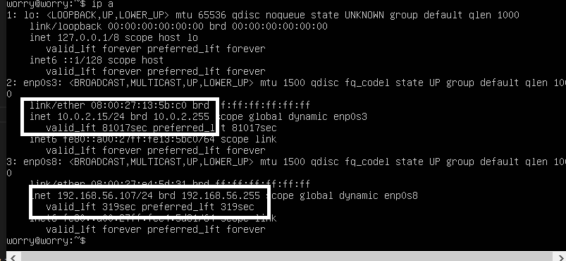
  
>观看老师教学视频得知在ubutun 18.04的版本会遇到新添加的网卡没有自动分配到ip地址的问题，所以下载老版本镜像进行此条实验

* 为Virtualbox安装的**Ubuntu18.04** 新添加的网卡进行网络配置
  * 安装配置好**ubuntu 18.04**之后（双网卡设置，断网安装操作）查看ip
    
    >结果显示有三个ip地址，lo是本地网络，enps03是虚拟网卡没有分配到ip地址，enps08有ip地址

  * 登录ubuntu20.04系统的虚拟机，查看网卡配置文件
    一开始使用的是`cat /etc/netplan/01-netcfg.yaml`命令（老师视频里的文件目录），但显示没有这个文件，思考可能是版本不同文件名不同，所以逐步手动进入目录，发现**在20.04系统上网络配置的文件名为00-installer-config.yaml**
    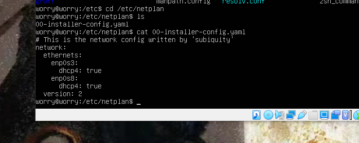

  >由于20.04版本的文件名和格式内容与老师视频里的文件格式不一致，所以我在18.04系统上查看一下该文件，观察其网络配置的文件模式。

  * 查找18.04.6版本下的配置文件名，对比发现和老师视频里的文件名和文件编写格式不一致，但和 20.04系统一致，**所以以20.04版本的配置文件格式为准**。
    

  * 按照20.04的网络配置文件修改18.04的网络配置文件**00-installer-config.yaml**
    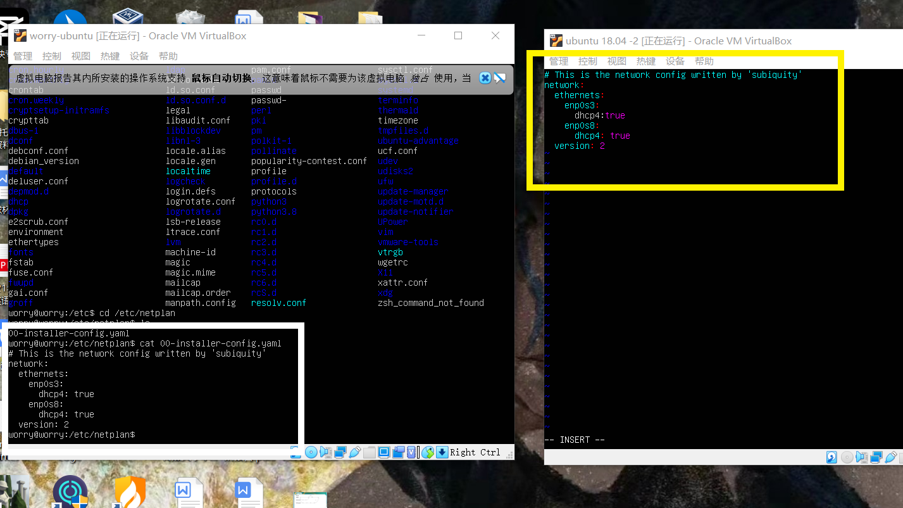

  * 使用`sudo netplan apply`配置失败
    
    >**原因是文件编写时缩进错误**，但是因为实验过程中没有立刻发现花费了许多时间在修改编写文件上，最后采用了没有完全和20.04系统完全一致的写法。
    - 修改文件的失败案例
   
   

    - 尝试多次修改方式后，终于成功！
    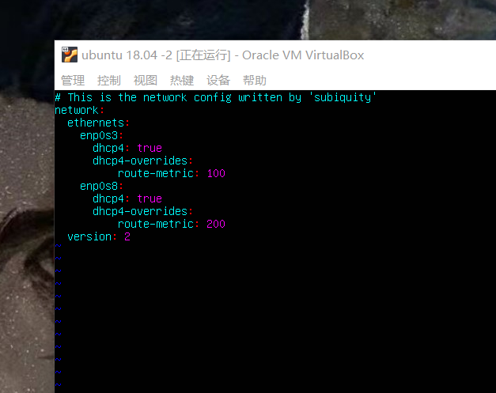
  * 使用`sudo netplan apply`配置成功，检查网络连通性
  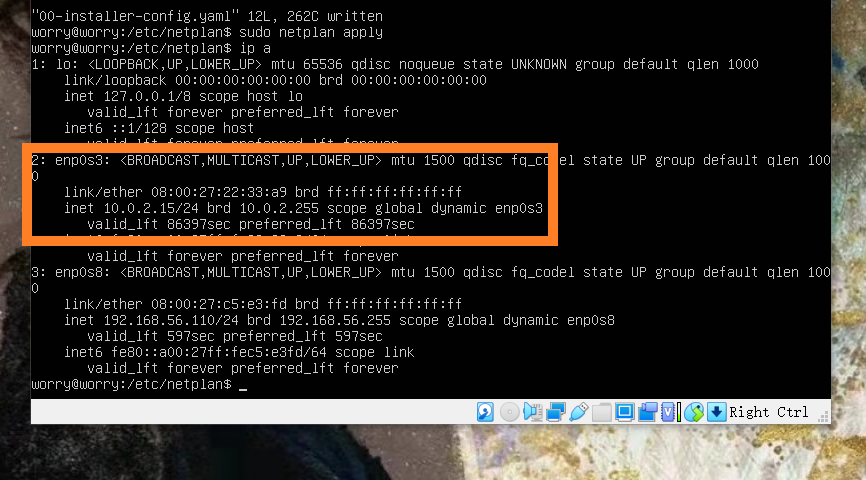
  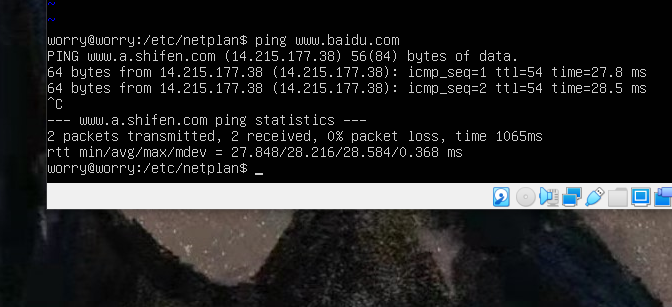
* 使用 scp 在「虚拟机和宿主机之间」传输文件
   - 确认在虚拟机ubuntu系统上测试是否能使用scp命令
     可以使用
     
   - 在windows上使用MobaXterm
     >对ssh有粗略的了解，windows是没有ssh功能的，可以通过git bash，MobaXterm等工具来代替OpenSSH使用，因为之前下载过MobaXterm，故直接使用MobaXterm。

     
   - 本机传送**文件**到虚拟机,尝试将桌面txt文件传输到虚拟机
      - 通过之前的`ip a`操作已得到ip地址
      - 输入操作`scp /home/LALAlostu/Desktop/hilinux.txt worry@192.168.56.107:/home/worry` 传输成功！
       
      
      - 在虚拟机中查看文件,文件名和内容一致
        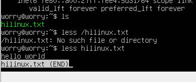

   - 本机传送**文件夹**到虚拟机
     >考虑到之后在宿主机和虚拟机之间传输文件一般都要以文件夹的形式传输，所有我想要尝试传输文件夹

     输入命令`scp -r /home/LALAlostu/Desktop/hilinux.txt worry@192.168.56.107:/home/worry`
      
   - 将**虚拟机文件**传输到宿主机目录
     输入命令`scp worry@192.168.56.107:/home/worry/hilinux.txt /home/LALAlostu/Desktop`
     
* 使用 scp 在「本机和远程 Linux 系统之间」传输文件
   - 本机依旧选择mobaxterm作为传输平台
   - 远程linux系统,利用阿里云 云服务
     - 登录阿里云，创建好linux系统资源
       可以看到我的远程机上的登录名为root，ip地址，和登录密码
       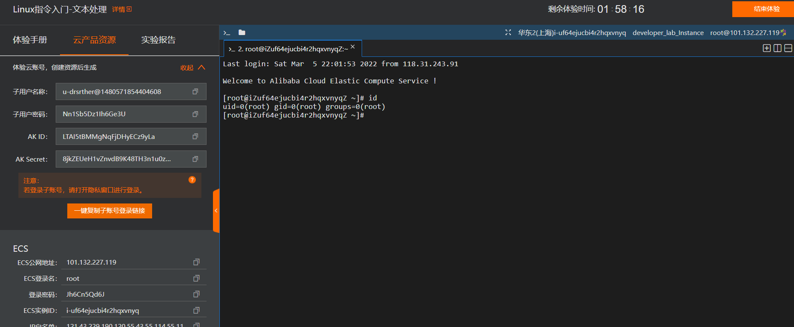
     - 查看当前所在目录
       
   - 本机传输文件给远程linux系统
      
      
* 配置 SSH 免密登录,选择宿主机和虚拟机
  - 在mobaxterm上生成公私钥对，提前建好一个存放的文件夹，格式要为.ssh/xxx
  - 之后输入密码
  - 生成成功
    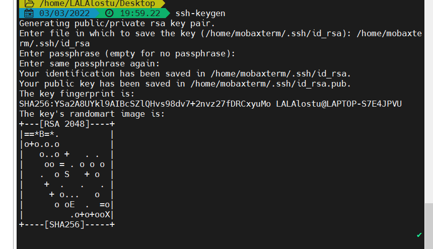
  - 将公钥发送给虚拟机，**注意：存放公钥的目录路径要写完整**
    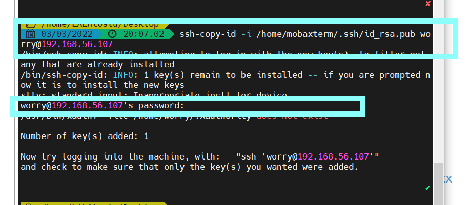
  
  - 尝试ssh免密连接，只需输入存放公私钥对文件的密码即可
    成功登录且能进行操作。
    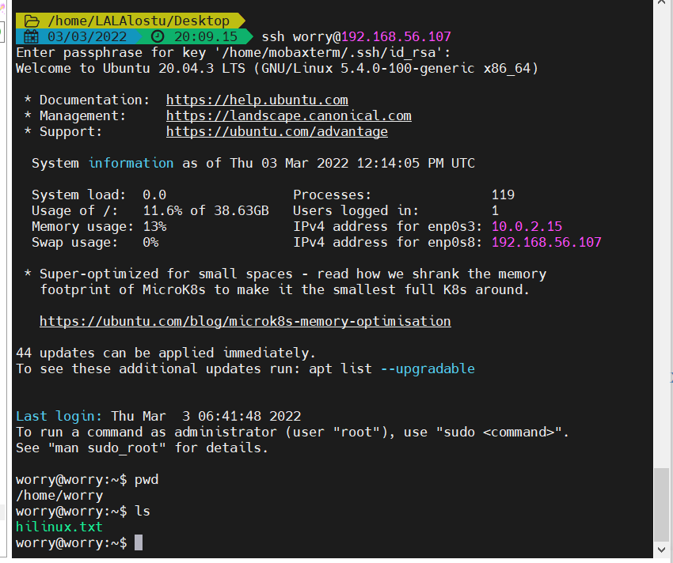
  - 退出 `exit`
    

## 遇到的问题及解决方法

* `lsb_release`命令的失败
  `lsb_release -a`
   命令行显示如下：
  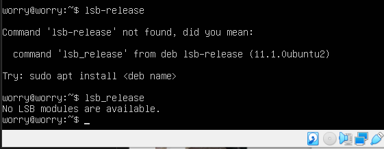

   - 由于我一开始使用的是错误的命令格式`lsb-release`,所以命令行提示使用`lsb_release`命令（由11.1.0 ubuntu2版本开始提供的deb lsb-release)并提示安装。
   - 直接输入`lsb_release`，命令行提示没有可以的lsb模型。
   - 在ubuntu官方网站搜索对`lsb_release`对比不同版本的Ubuntu对`lsb_release`的描述,发现描述一致。由此得知出现上述情况的原因，是因为**命令不对，缺少相应命令描述导致的**应该输入`lsb_release -a`
     描述截图如下：
     
     

  - 好奇 **No LSB modules are available** 的含义
    通过网上查询，了解到LSB core这个软件是不会预先就安装在系统上的，所以命令行才会提示没有LSB相关软件。
    >

* 安装配置好**ubuntu 18.04**之后（双网卡设置，断网安装操作），查看网卡设置，发现只有两块网卡且系统自动分配了ip地址
  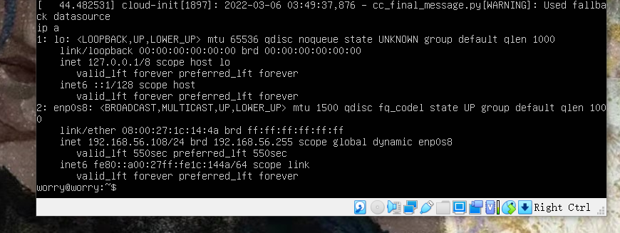
  - 和之前安装的20.04 版本的设置属性对比，发现网卡1选错了网络模式。**NAT网络**和**网络地址转换**不一样。
   
  - 更换之后，出现了三网卡，有一个网卡没有分配ip地址的情况
   

* 网络配置文件编写完后，使用`sudo netplan apply`配置失败
  **原因是文件编写时缩进错误**，但是因为实验过程中没有立刻发现花费了许多时间在修改编写文件上，最后采用了没有完全和20.04系统完全一致的写法。
  
  **这就是不好好看命令行报错的下场！！**

*  直接访问netplan没有该文件夹，`ls`命令后发现有该文件为什么进不去？
   观察到`ls`的结果里，netplan是蓝色标蓝的，思考是否和权限有关。
   仔细观察老师在视频里的操作发现老师在更改该文件时使用了**sudo**
   所以应该是直接访问是没有权限的，之后的对该文件的操作都要用`sudo`
 
* scp是什么？
  - 在ubuntu官网查看该命令
  - 使用bing搜索scp linux 关键词
    

    
  - 了解可得scp是linux系统的一个命令,并且是**OpenSSH**传送的一部分。 所以想要使用scp命令，首先要了解OpenSSH和两者之间使用关系。
  - 还了解了SCP命令的基本能使用格式：在传输时命令要写上接受放的ip地址，发送的文件目录。  

* 什么是OpenSSH？
  OpenSSH是使用SSH协议进行远程登录的主要连接工具。一直在不断升级，所以使用scp命令一定要openssh软件帮助。

* 怎么完成scp文件传输？
  - 目前的部分任务步骤已经整理出来
     - 首先在主机（host）和虚拟机上都安装好OpenSSH，然后再利用Scp进行文件传送。
     - 主机为windows，在windows上安装OpenSSH（mobaxterm）
     - 虚拟机系统为ubuntu，在ubuntu上安装OpenSSH
     - 完成相关命令

* 应该把文件传输到虚拟机的那里？
   - 需要了解linux系统查询文件，文件夹，保存文件等相关操作。
     观看老师视频，回顾课件学习命令行操作，使用`ls` ` man ls` `ls -a `操作查看所有文件
     

     学习使用linux基础命令行，`pwd`查看当前目录。
     

* scp命令执行反馈 no such file
  
  - 分析 我使用的是相对路径，尝试绝对路径，成功。

* 传输文件夹
  阅读文献，知道`scp -r` 递归复制整个目录，想知道使用`-r` 和不使用的区别。
   - 使用结果:
     - 使用`scp`无法传送文件夹
       
     - 使用`scp -r`成功
       

* 了解了ssh免密登录的方法后，有一个疑问：
  为什么把公钥发到远程机之后，就可以免密登录远程机了？把自己的钥匙给了别人,怎么就能登录别人的电脑呢？
   - 尝试配置免密登录后，发现在send 公钥到虚拟机时，需要输入虚拟机用户的密码，我认为这就是关键。
   - 因为在发送公钥给远程机时，需要输入一次远程机用户登录密码，也就是说拥有这个公私钥对的人知道登录密码。所有在之后的ssh连接时，虚拟机只需要通过公钥来认证登录者的身份即可。这一点是利用了信息安全里的公私钥对身份认证功能。
    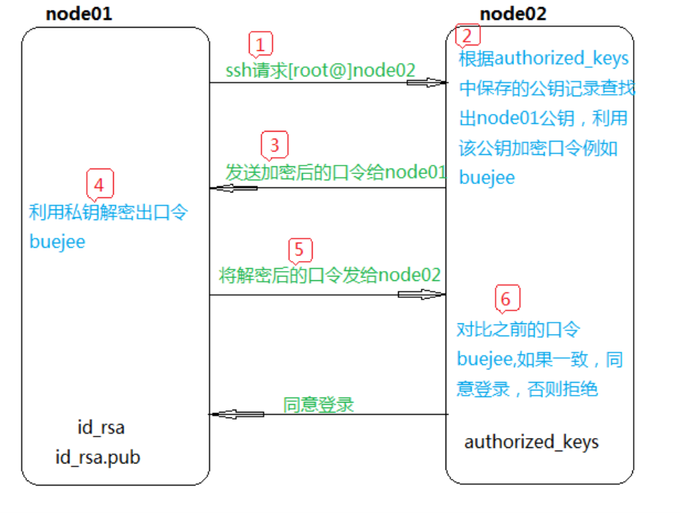
* 实验创建分支提交，git bash使用git branch无法看到分支信息，也无法创建新分支。
  这个问题真的折磨了我很久，而且在网上也很难搜索到解决方法。
  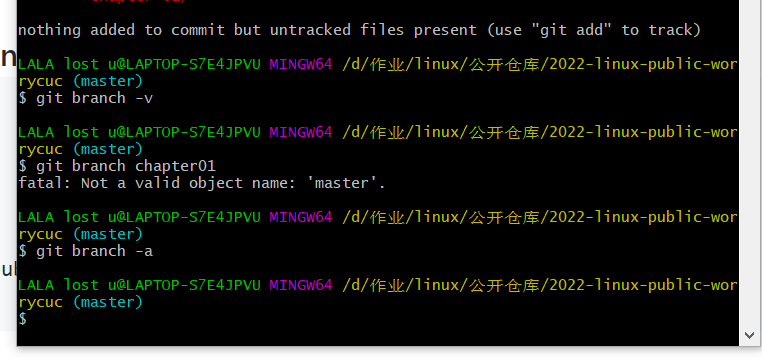
  - 解决的方法是：查看了老师给的作业提交结构范例和git hub上的操作方式得到了启发。
    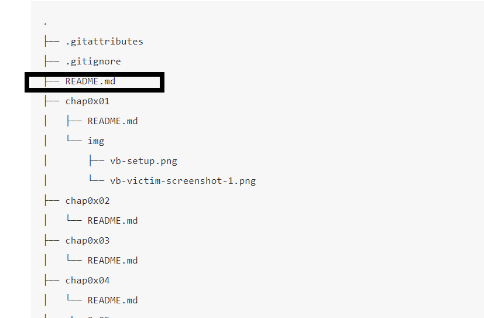
    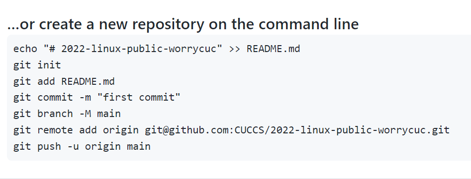
  - **查看分支和创建分支的基础是必须要先在master上commit一个文件**
  - 这样操作之后就能查看和创建分支了
    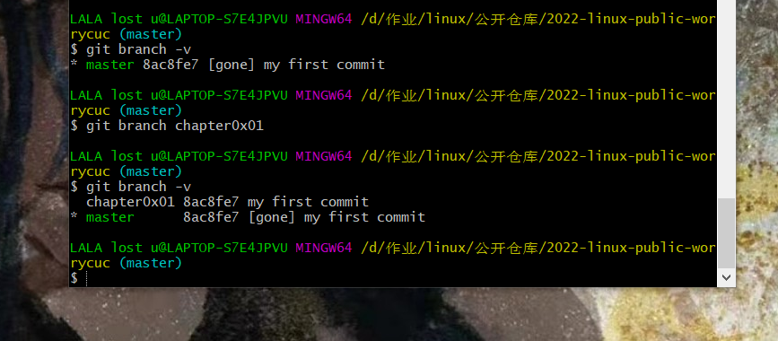

## 参考文献
* [Ubuntu manuals | lsb_release](http://manpages.ubuntu.com/manpages/focal/en/man1/lsb_release.1.html) 
* [Linux lsb_release command](https://www.computerhope.com/unix/lsb_release.htm )
* [linux-scp-command](https://www.ionos.com/digitalguide/server/configuration/linux-scp-command/)
* [ubuntu ssh传输文件——scp](https://blog.csdn.net/jackghq/article/details/64124062)
* [Linux基础-18.scp 跨机远程拷贝](https://linuxtools-rst.readthedocs.io/zh_CN/latest/tool/scp.html) 
* [OpenSSH 实践手册](https://zhuanlan.zhihu.com/p/356471276)
* [服务器之间传输文件－scp命令](https://zhuanlan.zhihu.com/p/22482509)
* [linux相关命令行操作](http://c.biancheng.net/view/5862.html)
* [ssh-copy-id三步实现SSH无密码登录和ssh常用命令](https://blog.csdn.net/liu_qingbo/article/details/78383892)
* [免密登陆和ssh-copy-id命令解析](https://blog.csdn.net/hanguofei/article/details/103135178)
* [Netplan configuration examples](https://netplan.io/examples/)
* [VirtualBox虚拟机Ubuntu配置网络及SSH登陆](https://blog.csdn.net/u014756245/article/details/120076982)
* [黄药师漫步桃花岛 | Linux 系统与网络管理(2021)](https://www.bilibili.com/video/BV1Hb4y1R7FE?p=3 )
* [About OpenSSH](https://www.openssh.com/)
* [推荐的目录结构和分支结构](https://c4pr1c3.github.io/cuc-ns/chap0x01/exp.html)