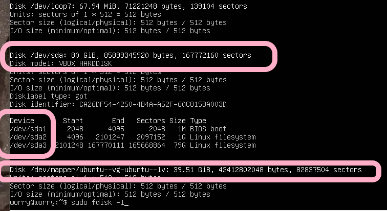

# 实验三：Linux服务器系统使用基础自查

## 实验目的

* 自查linux服务器系统使用基础相关操作学习成果

## 实验环境

* 宿主机：windows10
* 本机linux系统：ubutun 20.04.03 live-server 64bit
* 远程linux系统：阿里云 云起实验室提供的CentOS系统

## 实验要求
* [x] 如何添加一个用户并使其具备sudo执行程序的权限？
* [x] 如何将一个用户添加到一个用户组？
* [x] 如何查看当前系统的分区表和文件系统详细信息？
* [x] 如何实现开机自动挂载Virtualbox的共享目录分区？
* [x] 基于LVM（逻辑分卷管理）的分区如何实现动态扩容和缩减容量？
* [x] 如何通过systemd设置实现在网络连通时运行一个指定脚本，在网络断开时运行另一个脚本？
* [x] 如何通过systemd设置实现一个脚本在任何情况下被杀死之后会立即重新启动？实现杀不死？
* [x] 完整实验操作过程通过asciinema进行录像并上传，文档通过github上传

## 实验自评
实验完成情况：98%
## 实验过程记录

### 添加一个用户并使其具备sudo执行程序的权限

#### Ubuntu 20.04系统环境下:

```shell
sudo adduser hunter #添加用户
su #切换到root用户下
vi /etc/sudoers #修改文件以提升权限
su hunter #切换到hunter用户
sudo apt update #测试用户是否得到了提权
```

* 添加用户 hunter `sudo adduser hunter `；如图已成功添加用户hunter在hunter组。


* 切换到root用户 `su`，并修改sudoer文件为hunter用户提升权限`vi /etc/sudoers`。


* 验证sudo权限是否拥有，切换到hunter用户，使用`sudo apt update`


#### CentOS 环境下：


```shell
adduser worry #添加用户
passwd worry # 初始化密码
vi /etc/sudoers #修改文件以提升权限
su worry #切换到worry用户
sudo yum install zip #测试用户是否得到了提权
```

* 与ubuntu不同的是文件格式不太一样，CentOS的文件非常长，sudo权限的配置在很下面。


### 将一个用户添加到一个用户组

#### Ubuntu 20.04系统环境下:

```shell
addgroup rules # 创建组
id rue #查看rue当前属于的分组
getent group rules #查看rules组的信息
sudo usermod -a -G rules rue #将rules组作为rue的次要组
```

* 先查看当前所以用户和准备加入的分组的一些基本信息，`id rue` `getent group rules`


* 使用usermod将用户添加到次要组中，` sudo usermod -a -G rules rue`


* [过程记录【将一个用户添加到一个用户组】——Ubuntu 20.04](https://asciinema.org/a/480739)

#### CentOS 系统环境下:

```shell
groupadd # 创建组
id worry #查看rue当前属于的分组
getent group cuc #查看rules组的信息
 sudo usermod -a -G cuc worry #将rules组作为rue的次要组
```
* [过程记录【将一个用户添加到一个用户组】——CentOS 7](https://asciinema.org/a/481512)

### 查看当前系统的分区表和文件系统详细信息

#### Ubuntu 20.04系统环境下:

```shell
df -T #查看当前系统的分区和文件系统
sudo parted -l #如上
```

* `fdisk -l`如下图所示：系统下**只有一块总容量为80GB的硬盘，且该硬盘有三个主分区sda1、sda2和sda3**看不到文件系统类型



* `df -T`查看当前系统的分区和文件，但只可以查看已经挂载的分区和文件系统类型。


* 使用`sudo parted -l`会列出所有分区的信息及文件系统。如下图可以看到：**只有sda2分区创建了文件系统，文件系统类型是ext4**


* [过程记录【查看分区表和文件系统详细信息】——Ubuntu 20.04](https://asciinema.org/a/480733)

#### CentOS 系统环境下:

```shell
df -T #查看当前系统的分区和文件系统
parted -l #如上
```
* **该云服务器有一块物理硬盘，文件系统类型为ext4**
* [过程记录【查看分区表和文件系统详细信息】——CentOS 7](https://asciinema.org/a/481513)

### 实现开机自动挂载Virtualbox的共享目录分区

#### Ubuntu 20.04 系统环境下:

* 首先安装增强功能，才能实现共享文件夹

```shell
apt update
apt install dkms && apt install build-essential # 安装依赖工具
systemctl reboot # 重启
mount /dev/cdrom /mnt # 挂在cdrom 注意中间的空格！！
/mnt/VBoxLinuxAdditions.run #执行安装命令
unmount /mnt/ # 执行完后卸载
systemctl reboot #重启
```

* 在虚拟机上设置共享文件夹(固定分配)


* 修改system相关配置文件以实现开机自动挂载

```shell
sudo vim /lib/systemd/system/rc-local.service # 修改配置文件，追加以下功能
# [Install] 
# WantedBy=multi-user.target 
# Alias=rc-local.service

sudo touch /etc/rc.local # 无该文件，先创建该文件
sudo chmod 755 /etc/rc.local # 赋予可执行权限
sudo vim /etc/rc.local # 填写以下信息
# #!/bin/sh
# mount -t vboxsf share /mnt/share
# exit 0

sudo mkdir /mnt/share # 新建文件夹

# 创建软链接
sudo ln -s /lib/systemd/system/rc-local.service /etc/systemd/system/ 
systemctl reboot #重启

sudo systemctl set-default multi-users.target # 取消图形化界面，否则启动会变成图形化操作端，确保开机自动启动的是 multi-users.service
```


* 重启后可以看到挂载的文件夹内容，成功自动挂载


* [过程记录【开机自动挂载Virtualbox的共享目录分区】——Ubuntu 20.04](https://asciinema.org/a/481217)


### 基于LVM（逻辑分卷管理）的分区实现动态扩容和缩减容量

* 首先初始化好两个硬盘

```shell
lsblk # 查看磁盘状态
sudo fdisk /dev/sdb # 进入交互式磁盘分区界面
sudo gdisk /dev/sdc # 进入交互式磁盘分区界面

```


* 新硬盘创建LVM分区。创建好LVM分区后，创建目录和文件系统，实现挂载。如图可见**在三个物理分区上创建了一个VG,两个LV，且剩余物理空间为0**


```shell
sudo pvcreate /dev/sdb{1,2,3} # 创建物理分区PV
sudo pvcreate /dev/sdc{1,2}
sudo vgcreate worry-vg /dev/sdb{1，2，3} # 创建VG
sudo lvcreate -L 8G -n worry-lv-1 worry-vg # 创建逻辑分区
sudo lvcreate -l 100%FREE -n worry-lv-2 worry-vg
mkfs.ext4 /dev/worry-vg/worry-lv-1 # 挂载
mkfs.ext4 /dev/worry-vg/worry-lv-2
mkdir /mnt/worry-lv-1 # 创建挂载区
mkdir /mnt/worry-lv-2
mount /dev/worry-vg/worry-lv-1 /mnt/worry-lv-1
mount /dev/worry-vg/worry-lv-2 /mnt/worry-lv-2
```
  
* 分区实现动态扩容和缩减容量(卷组中无剩余空间)

```shell
sudo vgdisplay # 查看当前卷组空间使用情况
sudo pvscan  # 查看可添加的物理硬盘
sudo vgextend worry-vg /dev/sdc{1，2} # 将 PV 加入到VG 中，实现vg扩容

vgdisplay # 查看 VG 详细信息

lvdisplay # 查看 LV 详细信息

lvextend -L 10G /dev/worry-vg/worry-lv-1 #  分区扩容
resize2fs /dev/worry-vg/worry-lv-1   # 扩展文件系统

df -h   # 显示容量确实已扩大

# 分区缩减
lvresize --size -2G --resizefs worry-vg/worry-lv-1

df -h   # 显示容量确实减小
```


* [过程记录【LVM分区实现动态扩容和缩减容量】——Ubuntu 20.04](https://asciinema.org/a/481196)

### 【跟练】Systemd 入门教程：命令篇

#### Ubuntu 20.04系统环境下:

* 查看Systemd的版本

```shell
$ systemctl --version
```
得到版本为**systemd 245（245.4-4ubuntu3.15）**

[跟练【查看Systemd的版本】——Ubuntu 20.04](https://asciinema.org/a/480889)

* 系统管理systemctl命令

```shell

# 重启系统
$ sudo systemctl reboot

# 关闭系统，切断电源
$ sudo systemctl poweroff

# CPU停止工作
$ sudo systemctl halt

# 暂停系统
$ sudo systemctl suspend

# 让系统进入冬眠状态
$ sudo systemctl hibernate #自动退出了

# 让系统进入交互式休眠状态
$ sudo systemctl hybrid-sleep #自动退出

# 启动进入救援状态（单用户状态）
$ sudo systemctl rescue
```

如下图CPU停止工作


如下图暂停系统，但是只要点击任意键就可以唤醒系统。


* 系统管理systemd-analyze命令

```shell

# 查看启动耗时
$ systemd-analyze   

# 查看每个服务的启动耗时
$ systemd-analyze blame # q退出

# 显示瀑布状的启动过程流
$ systemd-analyze critical-chain

# 显示指定服务的启动流
$ systemd-analyze critical-chain atd.service # atd.service 为指定的服务
```
得到信息为**启动耗时12.075s**,**图形画面在8.252s之后出现在用户界面**

* 系统管理hostnamectl命令

```shell
# 显示当前主机的信息
$ hostnamectl

# 设置主机名。
$ sudo hostnamectl set-hostname worry333
```


* 系统管理localectl命令

```shell
# 查看本地化设置
$ localectl

# 设置本地化参数。
$ sudo localectl set-locale LANG=en_GB.utf8 # 设置为英式英语，字符编码UTF-8
$ sudo localectl set-keymap en_GB # 键盘映射设置为en_GB
```
得到本地化设置为**LANG=en_US.UTF-8**,**VC keymap：n/a**


* 系统管理timedatectl命令

```shell
# 查看当前时区设置
$ timedatectl

# 显示所有可用的时区
$ timedatectl list-timezones                                       

# 设置当前时区
$ sudo timedatectl set-timezone America/New_York
$ sudo timedatectl set-time YYYY-MM-DD
$ sudo timedatectl set-time HH:MM:SS
```
得到信息为**本系统使用的是美国时间**


* 系统管理loginctl命令

```shell
# 列出当前session
$ loginctl list-sessions

# 列出当前登录用户
$ loginctl list-users

# 列出显示指定用户的信息
$ loginctl show-user ruanyf
```

[跟练【系统管理部分命令】——Ubuntu 20.04](https://asciinema.org/a/480896)

* 系统资源管理systemctl list-units命令

```shell
# 列出正在运行的 Unit
$ systemctl list-units

# 列出所有Unit，包括没有找到配置文件的或者启动失败的
$ systemctl list-units --all

# 列出所有没有运行的 Unit
$ systemctl list-units --all --state=inactive

# 列出所有加载失败的 Unit
$ systemctl list-units --failed

# 列出所有正在运行的、类型为 service 的 Unit
$ systemctl list-units --type=service
```


* 系统资源管理systemctl status命令及systemctl

```shell
# 显示系统状态
$ systemctl status

# 显示单个 Unit 的状态（如ssh）
$ sysystemctl status ssh.service

# 显示远程主机的某个 Unit 的状态
$ systemctl -H root@106.14.148.217 status httpd.service # 远程主机为云服务器

# 显示某个 Unit 是否正在运行
$ systemctl is-active application.service

# 显示某个 Unit 是否处于启动失败状态
$ systemctl is-failed application.service

# 显示某个 Unit 服务是否建立了启动链接
$ systemctl is-enabled application.service
```


* 系统资源管理（Unit 管理）
```shell
# 立即启动一个服务
$ sudo systemctl start apache.service # 由于在ubuntu系统下没有实现安装

$ sudo apt update
$ sudo apt install apache2 # 安装apache

# 立即停止一个服务
$ sudo systemctl stop apache2.service

# 重启一个服务
$ sudo systemctl restart apache2.service

# 杀死一个服务的所有子进程
$ sudo systemctl kill apache2.service

# 重新加载一个服务的配置文件
$ sudo systemctl reload apache2.service # 首先该服务必须先启动

# 重载所有修改过的配置文件
$ sudo systemctl daemon-reload

# 显示某个 Unit 的所有底层参数
$ systemctl show httpd.service

# 显示某个 Unit 的指定属性的值
$ systemctl show -p CPUShares httpd.service

# 设置某个 Unit 的指定属性
$ sudo systemctl set-property httpd.service CPUShares=500
```


* 系统资源管理依赖关系

```shell
$ systemctl list-dependencies nginx.service #列出某Unit的所有依赖

$ systemctl list-dependencies --all nginx.service # 展开target类型依赖

```

[跟练【系统资源管理相关命令】——Ubuntu 20.04](https://asciinema.org/a/480903)

*  Unit配置文件

```shell
$ sudo systemctl enable clamd@scan.service # 两目录之间建立符号链接关系

$ sudo systemctl disable clamd@scan.service # 撤销两目录之间的符号链接

```

* Unit配置文件-配置文件状态

```shell
# 列出所有配置文件
$ systemctl list-unit-files

# 列出指定类型的配置文件
$ systemctl list-unit-files --type=service
```

* Unit配置文件-查看配置文件

```shell
$ systemctl cat atd.service # 查看atd服务的配置文件
```

[跟练【Unit配置文件相关命令】——Ubuntu 20.04](https://asciinema.org/a/480909)

* Target的相关操作

```shell

# 查看当前系统的所有 Target
$ systemctl list-unit-files --type=target

# 查看一个 Target 包含的所有 Unit
$ systemctl list-dependencies multi-user.target

# 查看启动时的默认 Target
$ systemctl get-default

```
查看发现本系统的开机自启动项只有**graphic.target**

[跟练【Target的相关操作】——Ubuntu 20.04](https://asciinema.org/a/480922)

* 日志管理journalctl

[跟练【日志管理journalctl】——Ubuntu 20.04](https://asciinema.org/a/480923)

#### CentOS 7.7系统环境下:
* 查看Systemd的版本

得到版本为**systemd 219**

[跟练【查看Systemd的版本】——CentOS 7.7](https://asciinema.org/a/481896)

* 系统管理命令

得到信息为**启动耗时9.289s**

键盘为**en_US-UTF8**

系统默认时间是**中国时间**

[跟练【系统管理部分命令】——CentOS 7.7](https://asciinema.org/a/481898)

* 系统资源管理

对脚本判断语句不识别？**命令行输出 `unknown operation 'is'`**


```shell
# 显示某个 Unit 是否正在运行
$ systemctl is-active application.service
```


[跟练【系统资源管理相关命令】——CentOS 7.7](https://asciinema.org/a/481903)

*  Unit配置文件

[跟练【Unit配置文件相关命令】——CentOS 7.7](https://asciinema.org/a/481906)

* Target的相关操作

开机自启动为**multi-users.target**

[跟练【Target的相关操作】——CentOS 7.7](https://asciinema.org/a/481907)

* 日志管理journalctl

[跟练【日志管理journalctl】——CentOS 7.7](https://asciinema.org/a/482132)

### 【跟练】Systemd 入门教程：实战篇
#### Ubuntu 20.04系统环境下:

* 开机启动
```shell
$ sudo systemctl enable ssh # 设置开机启动ssh软件
```

* 启动服务
```shell
$ sudo systemctl start ssh # 设置开机启动后，软件不会立即启动，所以现在启动服务
$ sudo systemctl status ssh # 查看服务状态
```

* 停止服务

```shell
$ sudo systemctl stop ssh.service # 终止服务
$ sudo systemctl status ssh # 查看服务状态，服务是否终止
$ sudo systemctl kill ssh.service #如果没有终止成功则杀进程
```
[跟练【启动终止服务实战】——Ubuntu 20.04](https://asciinema.org/a/480930)

#### CentOS 7.7 系统环境下:

[跟练【启动终止服务实战】——CentOS 7.7](https://asciinema.org/a/481910)

### 通过systemd设置实现一个脚本在任何情况下被杀死之后会立即重新启动,实现杀不死
#### Ubuntu 20.04 系统环境下
* 将配置文件的service 字段，**restart设置为always**，修改配置文件后重启。

```shell
sudo vim /lib/systemd/system/ssh.service # 修改文件配置restart设置为always
sudo systemctl reboot # 重启
sudo systemctl start ssh 
sudo systemctl status ssh # 查看服务状态
sudo systemctl kill ssh.service 
sudo systemctl status ssh # 查看服务状态
```


* [实验过程【实现杀不死脚本】——Ubuntu 20.04](https://asciinema.org/a/481565)

#### CentOS 系统环境下:

* 同样的操作
* [实验过程【实现杀不死脚本】——CentOS 7.7](https://asciinema.org/a/481912)
### 通过systemd设置实现在网络连通时运行一个指定脚本，在网络断开时运行另一个脚本

#### Ubuntu 20.04 系统环境下
```shell
sudo vim /etc/systemd/system/run-when-network.service # 编写配置文件，实现网络连通时运行该脚本
sudo vim /home/worry/do-something.sh # 编写脚本
sudo vim /home/worry/now-my-turn.sh
sudo systemctl reboot # 重启
sudo systemctl start run-when-network 
sudo systemctl status run-when-network # 查看服务状态
# 断网操作
sudo systemctl status run-when-network # 查看服务状态
```
* 编写配置文件。


* 编写两个脚本


* [实验过程【实现网络断开运行其他脚本】——Ubuntu 20.04](https://asciinema.org/a/481702)


#### CentOS 系统环境下:
```shell
sudo vim /lib/systemd/system/run-when-network.service # 编写配置文件，实现网络连通时运行该脚本
sudo vim /root/do-something.sh # 编写脚本
sudo vim /root/now-my-turn.sh
sudo systemctl reboot # 重启
sudo systemctl start run-when-network 
sudo systemctl status run-when-network # 查看服务状态
# 断网操作
sudo systemctl status run-when-network # 查看服务状态
```
* [实验过程【实现网络断开运行其他脚本】——CentOS 7.7](https://asciinema.org/a/481937)


## 结果汇总

|      Linux发行版本      |                     Ubuntu（20.04）                     |                        CentOS（7.7）                         |
| :---------------------: | :-----------------------------------------------------: | :----------------------------------------------------------: |
|     **添加一个用户**      |                      `adduser `                     |                       `adduser`                       |
|     **具备sudo执行程序权限**      |                      `vim /etc/sudoers`                      |                         `vim /etc/sudoers`                         |
|     **将一个用户添加到一个用户组**      |                      `usermod -a -G`                       |                         `usermod -a -G`                         |
|  **查看当前系统的分区表**   |                       `parted -l`                        |                         `parted -l`                         |
|     **查看文件系统详细信息**      |          `parted -l`           |                    `parted -l`                    |
|    **实现脚本杀不死**     |         `sudo vim /lib/systemd/system/xxx.service` `restart=always`    |              ` find . | xargs grep -ri '666'`                |
| **实现在网络连通时运行一个指定脚本，在网络断开时运行另一个脚本** |                    编写service配置文件，执行时运行一个脚本，断开时执行另一个脚本                 |                     编写service配置文件，执行时运行一个脚本，断开时执行另一个脚本                    |

------


## 遇到的问题及解决方法
* root没有初始密码，需要自己激活。使用`sudo passwd root`操作后即可激活root密码，之后就可成功切换到root用户。


* 在修改sudoers文件是，保存修改时提示该文件是readonly，使用`: wq!`可以保存成功。`ls-l`查看该文件的权限，发现root用户和用户组只能read，其他用户无任何权限。**既然只能read，但是为什么又能够修改呢？**查阅资料发现，使用vim/vi 修改后输入`:wq!`是可以修改只读文件的。


  

* 查看了分区表和文件系统详细信息后，想知道disk目录/dev/mapper/ubuntu是什么Linux device-mapper linear Device Mapper 是 Linux 2.6 内核中提供的一种从逻辑设备到物理设备的映射框架机制 逻辑卷管理.
  - ubuntu-vg 指的是LVM中的VG结构，ubuntu-lv指的是Lv结构
  - 使用命令`sudo vgdisplay`,`sudo lvdisplay`可以查看其中的相关信息。


* ubuntu server版怎么安装增强工具

1. 虚拟机点击 设置 -> 增强 ,可以看到右下角出现个光盘

2. 更新apt，安装依赖工具，run光盘

```shell
apt update
apt install dkms && apt install build-essential # 安装依赖工具
systemctl reboot # 重启
mount /dev/cdrom /mnt # 挂在cdrom 注意中间的空格！！
/mnt/VBoxLinuxAdditions.run #执行安装命令
unmount /mnt/ # 执行完后卸载
systemctl reboot #重启
```
**多次mount失败是因为格式错误**


* 在实现自动挂载时，Ubuntu突然变成图形化界面。
  - 修改开机自启动项后恢复了


```shell
sudo systemctl get-default # 本系统输出为 graphic.target
sudo systemctl set-defalut multi-users.target # 安装依赖工具
systemctl reboot # 重启
```


* 配置文件和脚本都显示正常，但是start后看服务的status还是inactive
  - 观察状态输出可以发现，该进程并不是从来没有启动过，而是**启动后就结束了**，可以看到bash的输出，两个脚本都有运行过，猜测该进程再完成操作后就结束了进程。
  - 修改配置文件增加 remainafterexit=yes ，之后start服务显示`active(exited)`，虽然显示的是`active`但是只是保留了状态，两个脚本都已经运行完。
  - 所以想要进程持续时间较长，则需编写脚本确保运行够长，有足够时间进行断网操作。


* 网络断开了，但是进程依旧无法结束。
  -  原因：查看`network-manager.service`的状态，发现断网操作后依旧是`active`的状态，又因为我的service配置文件是`requires`的`network.target`,所以断网后我的进程依旧会进行中。
  - 既然service配置文件不能检测断网，那就只能依靠脚本了。更改脚本，使脚本检验断网情况，成功满足条件。


## 参考文献

* [Ubuntu-server 18.04.2 LTS 安装VirtualBox增强功能](https://www.jianshu.com/p/45672da5e084)

* [virtualbox下怎么实现ubuntu20.04开机自动挂载共享文件夹?](https://freexyz.cn/zhishi/81720.html)

* [Ubuntu 18.04 启用 rc.local 设置开机启动](https://www.cnblogs.com/digdeep/p/9760025.html)

* [动态扩容](https://www.cnblogs.com/kevingrace/p/5845634.html)

* [linux 网络开启之后执行脚本](https://blog.csdn.net/qq_32835203/article/details/79258732)

* [shell脚本自动检测网络掉线和自动重连](https://www.jb51.net/article/177354.htm)

* [systemd 实践-WIFI自动重连](https://blog.csdn.net/weixin_44821644/article/details/121096046)

* [Systemd 入门教程：实战篇](https://www.ruanyifeng.com/blog/2016/03/systemd-tutorial-part-two.html)