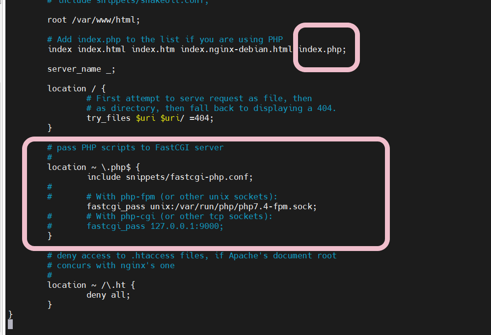
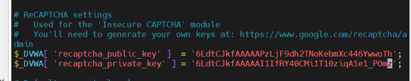

# 实验五：高级Web服务器相关配置

## 实验目的

* 学习支持反向代理、流量控制、关键词过滤等功能的高级Web服务器配置

## 实验环境

* 宿主机：windows10
* 配置Nginx和VeryNginx的虚拟机：ubuntu 20.04.03 live-server 64bit
* 测试虚拟机 ： Ubuntu 20.04 desktop 64bit；kali-linux-2021.3-live

## 实验要求
### 基本要求
* [x] 在一台主机（虚拟机）上同时配置Nginx和VeryNginx
    * [x] VeryNginx作为本次实验的Web App的反向代理服务器和WAF
    * [x] PHP-FPM进程的反向代理配置在nginx服务器上，VeryNginx服务器不直接配置Web站点服务
* [x] 使用Wordpress搭建的站点对外提供访问的地址为： `http://wp.sec.cuc.edu.cn`
* [x] 使用Damn Vulnerable Web Application (DVWA)搭建的站点对外提供访问的地址为：` http://dvwa.sec.cuc.edu.cn`
### 安全加固要求
* [x] 使用IP地址方式均无法访问上述任意站点，并向访客展示自定义的友好错误提示信息页面-1
* [x] Damn Vulnerable Web Application (DVWA)只允许白名单上的访客来源IP，其他来源的IP访问均向访客展示自定义的友好错误提示信息页面-2
* [x] 在不升级Wordpress版本的情况下，通过定制VeryNginx的访问控制策略规则，热修复WordPress < 4.7.1 - Username Enumeration
* [x] 通过配置VeryNginx的Filter规则实现对Damn Vulnerable Web Application (DVWA)的SQL注入实验在低安全等级条件下进行防护
### VeryNginx配置要求
* [x] VeryNginx的Web管理页面仅允许白名单上的访客来源IP，其他来源的IP访问均向访客展示自定义的友好错误提示信息页面-3
* [x] 通过定制VeryNginx的访问控制策略规则实现：
    * [x] 限制DVWA站点的单IP访问速率为每秒请求数 < 50
    * [x] 限制Wordpress站点的单IP访问速率为每秒请求数 < 20
    * [x] 超过访问频率限制的请求直接返回自定义错误提示信息页面-4
    * [x] 禁止curl访问

## 实验自评
实验完成情况：100%
## 实验过程记录

### 基本要求
* 修改hosts配置
  * 修改windows hosts文件,在`C:\Windows\System32\drivers\etc`找到hosts文件，备份后，进行修改
  
  

  * 修改linux虚拟机上的hosts配置。
    ```
      sudo vim /etc/hosts
      sudo systemctl restart networking.service
    ```


* 安装Nginx `sudo apt install nginx`
* 安装VeryNginx
  * 安装依赖
  ```
  sudo apt install libssl-dev libpcre3-dev zlib1g-dev
  ``` 
  * 克隆 VeryNginx仓库到本地，传到虚拟机上。
  * 然后进入仓库目录 `sudo python3 install.py install` 
* 修改VeryNginx配置文件
  * `vim /opt/verynginx/`
  * 将user字段改为`user root`，以可以有权限修改写入文件
  * 监听端口 使用host-only ip地址 **8080端口**
  
  
  
  * 成功通过宿主机登录verynginx后台web页面
  
  

* 安装wordpress
  * 安装LEMP堆栈（MySQL，PHP）
    * 安装MySQL
    ```
    sudo apt install mysql-server
    #安装后，运行MySQL预安装的安全脚本
    sudo mysql_secure_installation
    ```
    * 设置密码，选择密码强度(low,mid,high)。

    * 使用命令`sudo mysql`成功以root用户身份登入。
    
    

    * 安装PHP `sudo apt install php-fmp php-mysql`
    * 配置nginx以使用PHP
      * 对`/etc/nginx/sites-available/default `进行修改

      

      * 在`/var/www/html`里创建`info.php`
      * 重新加载nginx 测试php是否能够成功显示

      

  * 为wordpress创建web根目录
    ```
    #创建一个ip目录 
    sudo mkdir /var/www/wordpress
    # 改变目录属主
    sudo chown -R $USER:$USER /var/www/wordpress
    ```
      
    
    
  * 为WordPress创建MySQL数据库和用户。 
    * 其中用户的**密码必须符合强密码标准**。
    ```
    # 进入mysql
    sudo mysql
    # 创建数据库
    CREATE DATABASE wordpress DEFAULT CHARACTER SET utf8 COLLATE utf8_unicode_ci;
    # 创建用户
    CREATE USER 'wordpressuser'@'localhost' IDENTIFIED BY 'password';
    # 赋权
    GRANT ALL ON wordpress.* TO 'wordpressuser'@'localhost'
    ```
  * 安装PHP其他扩展
    ```
    sudo apt install php-curl php-gd php-intl php-mbstring php-soap php-xml php-xmlrpc php-zip
    # 安装后要重新启动 PHP-FPM 进程，以便正在运行的 PHP 处理器可以利用新安装的功能
    sudo systemctl restart php7.4-fpm 
    ``` 
  * 配置Nginx 
      ```
      # 在nginx下创建一个配置文件,监听端口8001
      sudo vim /etc/nginx/sites-available/wordpress
      # 激活配置
      sudo ln -s /etc/nginx/sites-available/wordpress /etc/nginx/sites-enabled/
      # 取消默认配置文件
      sudo unlink /etc/nginx/sites-enabled/default
      ```

  

  * 下载 **WordPress 4.7**
  ```
  cd /tmp
  curl -LO https://wordpress.org/wordpress-4.7.zip # 下载
  unzip wordpress-4.7.zip 
  # 在将wordpress文件移动到web文档根目录前，先将示例配置文件复制到WordPress实际读取的文件中
  cp /tmp/wordpress/wp-config-sample.php /tmp/wordpress/wp-config.php
  # 将wordpress目录的全部内容复制到web文档根目录中
  sudo cp -a /tmp/wordpress/. /var/www/wordpress
  # 将文件所有权分配给 www-data 用户和组，以保证Nginx能够读取和写入WordPress文件
  sudo chown -R www-data:www-data /var/www/wordpress
  ```

  

  * 编写WordPress配置文件,首先从WordPress密钥生成器中获取安全值. `curl -s https://api.wordpress.org/secret-key/1.1/salt/` **每个人的都不同**

  

  * 打开WordPress配置文件,`sudo vim /var/www/wordpress/wp-config.php`将输出结果粘贴到配置文件中以设置安全密钥。
  * 修改文件开头的一些数据库连接设置.数据库名为本机的设置好的数据库名wordpress

  

  * 用宿主机在web端进行安装,成功安装完成! 
  
  


* 安装Damn Vulnerable Web Application (DVWA)
  * 创建web目录
  ```
  # 和wordpress类似的操作
  cd /var/www/html
  sudo mkdir /var/www/html/dvwa
  sudo chown -R $USER:$USER /var/www/html/dvwa
  ```

  * 为DVWA创建MySQL数据库和用户。 
  ```
  sudo mysql
  CREATE DATABASE dvwa DEFAULT CHARACTER SET utf8 COLLATE utf8_unicode_ci;
  CREATE USER 'dvwauser'@'localhost' IDENTIFIED BY '自定义';
  GRANT ALL ON dvwa.* TO 'dvwauser'@'localhost';
  ```
  
  * 下载 **DVWA**
  ```
  cd /tmp
  curl -LO https://github.com/digininja/DVWA/archive/master.zip
  unzip master.zip

  # 将dvwa文件移动到web文档根目录前，先依据dist范例创建config.inc.php 
  touch /tmp/DVWA-master/config/config.inc.php
  cp /tmp/DVWA-master/config/config.inc.php.dist /tmp/DVWA-master/config/config.inc.php

  # 将dvwa目录的全部内容复制到web文档根目录中
  sudo cp -a /tmp/DVWA-master/. /var/www/html/dvwa
  # 将文件所有权分配给 www-data 用户和组
  sudo chown -R www-data:www-data /var/www/html/dvwa
  ```

  * 修改dvwa相关配置 
    * 修改数据库相关配置`sudo vim /var/www/dvwa/config/config.inc.php`,填入已创建的数据库相关信息

    

    * 在 `https://www.google.com/recaptcha/admin/create` 申请网站，将输出结果粘贴到配置文件中以设置安全密钥。`$_DVWA[ 'recaptcha_public_key' ] & $_DVWA[ 'recaptcha_private_key' ]`

    

    * 修改php设置 
    ```
      vim /etc/php/7.4/fpm/php.ini 
      # 修改内容如下
      allow_url_include = on
      allow_url_fopen = on
      display_errors = off
    ```
  * 修改nginx相关配置
  
  ```
  # 创建dvwa的site-available文件
  cp /etc/nginx/sites-available/wordpress  /etc/nginx/sites-available/dvwa
  # 建立软连接
  sudo ln -s /etc/nginx/sites-available/dvwa /etc/nginx/sites-enabled/

  # 对dvwa的site-available文件进行修改
  sudo vim /etc/nginx/sites-available/dvwa
  # 将端口设置为8002，防止端口占用
  ```

   

  * 用宿主机在web端进行安装,成功安装完成!
  
  


* 配置VeryNginx使其作为本次实验的Web App的反向代理服务器和WAF
  * 通过宿主机访问web操作端，先添加新的匹配规则。其中host名称为nginx配置中的server name。
  
  

  

  * 配置反向代理
  
  

  * 设置location

  

  * 成功访问网站

  

  

### 安全加固要求
* 使用IP地址方式均无法访问上述任意站点，并向访客展示自定义的友好错误提示信息页面-1
  * 添加新的matcher并使用正则匹配式，因为通过IP访问时，HOST 字段是IP地址，而通过域名访问时请求头中 HOST 字段是域名。
  
  

  * 添加新的response
  
  

  * 在custom中添加新的filter **显示状态码403，不应设置为404**。403状态代码，可以理解为访问端没有权限访问服务器，表示服务器暂时或者永久拒绝本次请求访问，404，这时候可能就是服务器已经删除页面或者资源，导致浏览出错，不是服务器拒绝访问。
  
  
  
  * 测试
  
  

* Damn Vulnerable Web Application (DVWA)只允许白名单上的访客来源IP，其他来源的IP访问均向访客展示自定义的友好错误提示信息页面-2
  * 添加新的matcher，白名单ip：192.168.56.112,且访问的host为`dvwa.sec.cuc.edu.cn`
  * 添加新的response，filter
  
  

  

  

  * 测试
  


* 在不升级Wordpress版本的情况下，通过定制VeryNginx的访问控制策略规则，热修复WordPress < 4.7.1 - Username Enumeration
  * 根据老师给的信息 访问 `wp.sec.cuc.edu.cn/wp-json/wp/v2/users/` 会返回一个json
  * 添加filter使得改url不能访问
  
  
  
  
  
  * 测试
  
  

* 通过配置VeryNginx的Filter规则实现对Damn Vulnerable Web Application (DVWA)的SQL注入实验在低安全等级条件下进行防护
  * 将DVWA网站的安全等级条件设置为低安全

  

  * 测试未添加filter规则时的SQL注入，通过sql注入可以获取数据库名称
  
  

  * 增添filter，对request args进行约束。请求体的name为 id ，value对 union，select字段 禁用 
  
  
  
  
  
  
  
  * 效果测试
  
  


### VeryNginx配置要求
* VeryNginx的Web管理页面仅允许白名单上的访客来源IP，其他来源的IP访问均向访客展示自定义的友好错误提示信息页面-3
  * 同样的添加新的规则，和response，filter。
  
  
  
  
  
  

  * 测试

   

* 限制DVWA站点的单IP访问速率为每秒请求数 < 50，限制Wordpress站点的单IP访问速率为每秒请求数 < 20，超过访问频率限制的请求直接返回自定义错误提示信息页面-4
  * 使用verynginx里的frequency limit
  * 编写response

  
  
  
  
  * 编写脚本在位于白名单的虚拟机中测试
  * 使用apache bench 进行压力测试 
  ```shell
  #!/usr/bin/env bash
    ab -n $1 -c 30 $2
  ```

  
  * 禁止curl访问
    * 编写filter 
    
    
    
    
    

    * 测试

    

## 遇到的问题及解决方法
* 安装VeryNginx的一些报错
  * 没有安装好相关依赖，除了文档里故障排除的 `libssl-dev` `libpcre3-dev`之外，还提示确实zlib
    
    

  * 脚本运行时，没有创建文件的权限

      

* 解决方法：
  * `sudo apt install zlib1g-dev` **注意时1g**
  * `sudo python3 install.py install` 
* 无法启动VeryNginx
  
  

  * 登录网站，原来是之前安装的apache2占用了端口
  
  

  * 删除后，启动成功

* 无法看到网站 404Notfound
  * 在讨论区询问老师后，查看error.log 得到老师的解答
  * vernginx没有权限操作rua_write这个文件，`ls -la /opt/ `查看文件属主
  * 在nginx.conf配置文件修改user 为 root


* 使用verynignx进行反向代理时，设置的ip访问限制，SQL注入热修复无法成功实现。
  * 仔细观察师哥师姐的实验报告里测试时访问的链接，发现了问题出现原因。
  * 我一开始访问网站时使用的是 `wp.sec.cuc.edu.cn:8001`，如果使用这个访问网站的话就会直接访问到搭建的网站本身，没有经过verynginx的反向代理，自然也不会有verynginx设置的限制。
  * 当我使用`wp.sec.cuc.edu.cn:8080`(8080为verynginx的端口号)时，我就通过verynginx的反向代理访问了该网站，自然就会受到ip访问限制。

## 参考文献
* [verynginx官方文档](https://github.com/alexazhou/VeryNginx/blob/master/readme_zh.md#%E5%AE%89%E8%A3%85%E5%92%8C%E4%BD%BF%E7%94%A8%E8%AF%B4%E6%98%8E)
* [安装wordpress](https://www.digitalocean.com/community/tutorials/how-to-install-wordpress-with-lemp-on-ubuntu-20-04)
* [反向代理理解](https://blog.csdn.net/weixin_38719347/article/details/104576946)
* [如何在Ubuntu 20.04中为Nginx创建自签名SSL证书](https://www.digitalocean.com/community/tutorials/how-to-create-a-self-signed-ssl-certificate-for-nginx-in-ubuntu-20-04-1)
* [DVMA官方文档](https://github.com/digininja/DVWA)
* [DVMA官方文档gitee](https://gitee.com/Moreant/DVWA/)
* [nginx的https配置及nginx端口转发ssl服务端口](https://www.csdn.net/tags/MtjaIg4sNDkwMzgtYmxvZwO0O0OO0O0O.html)
* [https nginx 换成其他端口_Nginx设置ssl证书实现https安全连接](https://blog.csdn.net/weixin_42456278/article/details/112373899)
* [DVWA全级别之SQL Injection（注入）](https://www.cnblogs.com/199904-04/p/12303570.html)

