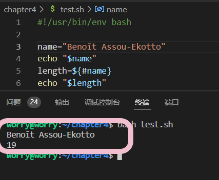
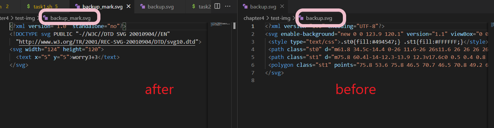

# 实验四：shell脚本编程基础

## 实验目的

* 学习Linux shell脚本的编写

## 实验环境

* 宿主机：windows10 Vscode Remote
* 本机linux系统：ubutun 20.04.03 live-server 64bit

## 实验要求
* 课内练习：求2个数的最大公约数，要求：
    - [x] 通过命令行参数读取2个整数，对不符合参数调用规范（使用小数、字符、少于2个参数等）的脚本执行要给出明确的错误提示信息，并退出代码执行

* 任务一：用bash编写一个图片批处理脚本，实现以下功能：
  * [x] 支持命令行参数方式使用不同功能 getopt getopts
  * [x] 支持对指定目录下所有支持格式的图片文件进行批处理
  * 支持以下常见图片批处理功能的单独使用或组合使用
    - [x] 支持对jpeg格式图片进行图片质量压缩
    - [x] 支持对jpeg/png/svg格式图片在保持原始宽高比的前提下压缩分辨率
    - [x] 支持对图片批量添加自定义文本水印
    - [x] 支持批量重命名（统一添加文件名前缀或后缀，不影响原始文件扩展名）
    - [x] 支持将png/svg图片统一转换为jpg格式图片

* 任务二：用bash编写一个文本批处理脚本，对以下附件分别进行批量处理完成相应的数据统计任务：
  * 2014世界杯运动员数据
    - [x] 统计不同年龄区间范围（20岁以下、[20-30]、30岁以上）的球员数量、百分比
    - [x] 统计不同场上位置的球员数量、百分比
    - [x] 名字最长的球员是谁？名字最短的球员是谁？
    - [x] 年龄最大的球员是谁？年龄最小的球员是谁？

  * Web服务器访问日志
    - [x] 统计访问来源主机TOP 100和分别对应出现的总次数
    - [x] 统计访问来源主机TOP 100 IP和分别对应出现的总次数
    - [x] 统计最频繁被访问的URL TOP 100
    - [x] 统计不同响应状态码的出现次数和对应百分比
    - [x] 分别统计不同4XX状态码对应的TOP 10 URL和对应出现的总次数
    - [x] 给定URL输出TOP 100访问来源主机


## 实验自评
实验完成情况：98%

## 实验过程记录

### 课内练习——求2个数的最大公约数
* 首先先对最核心的最大公约数求法进行算法设计。求两个数的最大公约数，数论里有欧里略算法，但是使用shell脚本完成该算法难度还是较高。所有选择最简单的算法：2到min(A,B)的整数都计算是否能够整除A,B，求出最大值。
  ```shell
    num=2
    temp=1
    while [[ $num -le $1 ]]&&[[ $num -le $2 ]] #求最大公约数
    do
      if [[ $(($1%num)) ]]&&[[ $(($2%num)) ]]&&[[ $num -gt $temp ]];then
        temp=$num
        num=$((num+1))
      fi
    done
    echo "GCD is $temp"
    
  ```
* 对不符合参数调用规范的（使用小数、字符、少于2个参数等）的脚本执行进行判断
  * 少于两个参数 `if [[ $# -ne 2 ]]` 
  * 使用小数，字符。
  ```shell
  echo "$1" |sed 's/\.//g'  | grep [^0-9] >/dev/null
  if [[ $? -eq 0 ]];then
    echo "$1 is a character"
    exit 126
  else 
    expr $1 + 1 &>/dev/null #对输入值进行运算
    if [[ $? -ne 0 ]];then
      echo "$1 is a decimal"
      exit 126
    fi
  fi
  ```
* 参数不符合调用规范，脚本退出代码执行。 `exit 126`

### 任务一 ——图片批处理
* 支持通过命令行参数方式使用不同功能，命令行的参数可以决定使用的功能。内置help函数帮助理解脚本功能。编写help函数解释命令行参数功能，利用getopts解析命令行参数。
  ```shell
  function help() {
  echo "Usage: ./task2-2.sh [OPTIONS]"
  echo "Options:"
  printf " -h , --help           for help\n"
  printf " -j [files/docmentary], --jpeg/jpg           image compression for jpeg image\n"
  #其他参数值省略
  }

  function parse_opts() {
  while getopts ":hj:c:w:r:s:" opt;do
    case $opt in
    h)
      help
      ;;
    j)
      echo "参数值：${OPTARG}"
      image_compre "${OPTARG}"
      ;;
    # 其他参数省略
    *)
      echo "无效或不存在选项"
      help
      exit 0
      ;;
  esac
  done
  }
  ```
* 在实现批处理功能时，无论是压缩操作还是重命名等其他操作都需要有遍历目录及其下子目录的功能。该功能我认为在我能力范围内能想到的最简单的方式就是使用find命令列出所有文件，再依次进行操作。
  ```shell
  function traverse { #负责遍历
  echo "$1"
  workdir="$1"
  for file in $(find ${workdir} -type f); do 
     echo "$file"
     image_compre "${file}"
  done
  }
  ```
* 在对文件进行操作前，要先对不符合格式的文件名进行预处理，以防止操作无法正常进行。这里的不符合格式指的是名字里带有空格。即要先除去空格作为分隔符的效果。
  ```shell
  SAVEIFS=$IFS
  $IFS=$(echo -en "\n\b")
  # 此处省略执行代码
  IFS=$SAVEIFS
  ```
* 对图片格式进行判断以确定是否操作。利用cut进行字符串处理。由于不确定目录的编写格式，即可能会出现`./*.jpeg`的情况，字符串处理的逻辑是，取以`.`为分隔符分隔得到的最后字段，进行格式判断。
  ```shell
  if [ "$(echo "$folderpath" |rev| cut -d "." -f 1 |rev )" = "jpeg" ];then
  # 此处省略执行代码
  fi
  ```
  * 对于遍历得来的文件还有更简便的操作，利用find命令中name的筛选功能。
  ```shell
    for file in $(find "$folderpath" -name "*.jpeg" -or -name "*.png" -or -name "*. svg" -or -name "*.jpg" );do #遍历的同时进行图片格式判断
      echo "$file"
      #convert "$file" -quality "$quality" "$file"
    done
  ```
* 对遍历得到的文件字符串进行字符串处理。该字符串可分为三部分
  * 文件格式部分获取
    ```shell
    type=$(echo "$folderpath" | rev | cut -d "." -f 1 | rev)
    ```
  * 文件名部分获取和路径获取
    ```shell
    name=$(echo "$folderpath" |rev| cut -d "." -f 2- | rev) #文件格式前的字符串部分
    name3=$(echo "$name" | rev | cut -d "/" -f 1 | rev) #如果字符串部分含有路径，此为真正的文件名
    name1=$(echo "$name" |rev| cut -d "/" -f 2- | rev)  # 路径部分
    name4=$(echo "$name3" | cut -d "." -f 1) #文件名去掉 . 
    ```
* 编写各命令行参数对应的函数的核心功能。
  * 图片质量压缩 —— `gzip`
  * 在保持原始宽高比的前提下压缩分辨率  —— **ImageMagick**中的`convert  -quality`命令 
  ```shell
  convert "$folderpath" -quality "$quality" "$folderpath"
  ```
  * 统一添加文件名前缀或后缀 利用 `mv` 命令，使用该命令前先对文件名进行字符串分隔以得到理想的文件名效果。
  ```shell
      mv "$folderpath" "$newname"
  ```
  * 生成文本水印 —— **ImageMagick**中的`convert -gravity  -fill  -pointsize -draw `操作
  ```shell
    convert "${file}" -gravity southeast -fill black -pointsize 16 -draw "text 5,5 'worry3+3'" "${name}_mark.${name2}"
  ```
  * 转换为jpg格式 —— **ImageMagick**中的 `convert "$file" "${name}_exchange".jpeg`
  ```shell
    convert "$file" "${name}_exchange".jpeg
  ```
* 应对多种情况的能力
  * 如果用户不选择批处理，输入的路径就是文件。为适应上述情况，得到路径后先对路径进行判断，是文件还是目录。
  
   

  * 为文件名统一添加前缀或后缀，只添加前缀、只添加后缀、没有前缀后缀（无变化）,路径的完整正确保留和出现。
   
   


*  测试性能，讲图片目录传给虚拟机 `scp `,进行功能测试，查看运行结果

  

  


### 任务二 a——2014世界杯运动员数据
* 下载文本文件后对文件内容和结构格式进行分析,该文件以`tab`为分隔符，内容包括国家、姓名、年龄、位置等。


* 编写help函数解释命令行参数功能，利用getopts解析命令行参数，与任务一一致。
* 实现逐行阅读文本 
```shell
while read line #逐行阅读
do
 #省略具体文本处理内容
done < ../worldcupplayerinfo.tsv
```
* 完成相应文本处理
  * 年龄统计，根据分析，年龄部分的字段是每行以`tab`分隔的第六部分；提取了年龄字段后，比较数值大小计数。
  ```shell
  age=$(echo "$line" | cut -f 6) #对每行字符串提取出年龄部分
  # echo "$age"
  if [[ $age -lt 20 ]];then  #小于20
    s_count=$((s_count+1))
  elif [[ $age -gt 30 ]];then #大于30
    l_count=$((l_count+1))
  fi
  dm_count=$((m_count+1)) #20——30之间
  ```
  * 位置统计，根据分析，位置部分的字段是每行以`tab`分隔的第五部分；提取了位置字段后，因为位置只有4种，类型较少，使用`case`进行分类。**需要特别注意的一点是，文件内有一位值的字符为Défenseur**
  ```shell
  position=$(echo "$line" | cut -f 5)
  echo "$position"
  case $position in
        "Goalie")
         g_count=$((g_count+1));;
        "Defender")
         d_count=$((d_count+1));;
        "Midfielder")
         M_count=$((M_count+1));;
        "Forward")
         f_count=$((f_count+1));;
         "Défenseur" )
         d_count=$((d_count+1));;
        "") exit
  esac
  ```
  * 最年长和最年轻球员，获取年龄字段和对应的姓名后，每次将提取的年龄与上一次结果进行比较，存储下较大值和较小值以及对应姓名。
  ```shell
  age=$(echo "$line" | cut -f 6) # 年龄字段
  name=$(echo "$line" | cut -f 9) # 对应的球员姓名
  echo "$age"
  if [[ $age -lt $min ]];then
    min=$age #存放每次比较最小值
    yougest=$name
  elif [[ $age -gt $max ]];then
    max=$age #存放每次比较最大值
    oldest=$name
  fi
  ```
  * 姓名长度，这里姓名长度的比较是以**字符个数**为标准。提取姓名片段后，先对字符串进行预处理，在使用`${#STRING}`的方式取得长度，进行比较得到最大值和最小值。

* 关于名字长度的字符个数比较有几点需要特别**注意**：
  * 有些球员名字之间有空格或 `"-"`，需要使用文本处理命令去除空格和短杠
  ```shell
    name1=${name//-/} # 去掉-
    name2=${name1// /} # 去掉空格
  ```
  * 一些球员名字有特殊字母
  
  

  * 测试对上述情况的字符计算结果,可以正常数，即一个字母占一个字符数。
  
  

  ```shell
    name=$(echo "$line" | cut -f 9)
    echo "$name"
    name1=${name//-/} # 去掉-
    name2=${name1// /} # 去掉空格
    length=${#name2}
    if [[ $length -lt $min ]];then
        min=$length
        shortest=$name
    elif [[ $length -gt $max ]];then
        max=$length
        longest=$name
    fi
  ```


### 任务二 b——Web服务器访问日志
* 下载文本文件后对文件内容和结构格式进行分析,文件数据由主机ip，主机id，请求方法，URL，状态码，用户编号组成。
* 前三项功能都是一样的思路，将需要输出的字段去重，记录重复次数，在倒序排序，输出前100位
  ```shell
  awk -F '\t' '{print $3}' web_log.tsv | sort | uniq -c | sort -nr | head -100 
  ```
* 统计不同的状态码和百分比，就无法按上式完成，选择在AWK中内写函数完成该操作。**AWK计算是浮点数计算**。
  * 唯一需要注意的一点就是。不要把行名也算进去，采用 `$6 !~ /[response]/` 来实现
    
    
  
  ```shell
    awk -F '\t' 'BEGIN{counts=0;printf "times: percentage: status:\n"} $6 !~ /response/ {status[$6]=$6;times[$6]++;counts++} END{for(code in status) {print times[code],code,times[code]*100/counts,"%"}}' web_log.tsv 
    # $6 !~ /[response]/ 去掉respons行
  ```
* 个人认为最难实现的功能是**分别统计**不同4XX状态码对应的TOP 10 URL和对应出现的总次数。
  * 第一步：`awk -F '\t' '$6 ~ /^4/ {print $5,$6}' web_log.tsv | sort -k 2 |uniq -c | sort -nr`  得到 4xx状态码对应的URL 和次数
  * 第二步  `rev| awk -F ' ' '{print $3,$2,$1}' | rev `，将次数放在最后，因为awk在打印时，会靠右对齐，前面的空格数不定，这样后格式标准分隔符只是一个空格
  * 第三步  因为次数已经在第一步已经排序好了所以不需要再排序，分404，403 输出前10 就好 
  ```shell
    awk -F '\t' '$6 ~ /^4/ {print $5,$6}' web_log.tsv | sort -k 2 |uniq -c | sort -nr |rev| awk -F ' ' '{print $3,$2,$1}' | rev |awk -F ' ' 'BEGIN{
    counts=0;line=0;printf "times: url: \n"} {url[line]=$2;url_status[line]=$1;times[line]=$3;status[$1]=$1;line++} END{
        for(code in status){
            print code,"------------";counts=0;line=0;while(counts < 10){
                if(url_status[line]==code){print times[line],url[line];counts++;};line++}}}' 
  ```

* 最后，给定URL输出TOP 100访问来源主机。只需在AWK中设置变量，将命令行输入的参数传入即可。
  ```shell
  awk -F '\t' -va="${OPTARG}" '{if($5==a)print $3}' web_log.tsv | sort | uniq -c | sort -nr | head -100 
  
  ```

## 遇到的问题及解决方法
* 如何判断输入的参数为小数或字符或整数。
  * 首先，查询资料了解到在shell脚本中变量值没有类型之分，都是一串字符串，所以想要区分这三者只能根据三者之间显示特性进行区分。
  * 我决定采用排除法来确定类型。**第一步先判断是否为整数**，如果两个变量都为整数则进行最大公约数计算。由于在shell脚本里一般的运算和大小比较只能够对整数有用，所以利用这个特性可以轻松判断参数是否为整数。
  * 第二步，对不是整数的字符串进行**是否为小数的判断**。在字符串表示中，小数和整数的区别就在于小数含有小数点，所以只要**使用文本处理工具将小数点删除**，则该字符串在脚本看来就是整数可以进行整数计算。
  * 排除了整数和小数的情况，则剩下的情况就是字符。
  ```shell
  expr $1 + 1 &>/dev/null #对输入值进行运算
  if [ $? -eq 0 ];then #如果上述命令正常执行则为整数
  ``` 

  ```shell
  echo "$1" |sed 's/\.//g'  | grep [^0-9] >/dev/null #利用sed对参数进行处理，删去小数点，再利用grep 看是否能够匹配一个不在0-9范围内的字符。
  if [ $? -eq 0 ];then #如果上述命令不正常执行则为小数
  ``` 


* 文件名内含空格，导致操作无法正常进行。linux终端会将空格视作分割符。如下图情况,文件名内有空格，在脚本执行时，会将该文件名分成两个部分，导致无法正常进行操作
  * 解决方法：在进行脚本运行前，修改 `bash` 中变量`IFS` 将空格作为字符串分割删去，然后在脚本执行后将`IFS`恢复为初值。
  ```shell
  SAVEIFS=$IFS
  $IFS=$(echo -en "\n\b")
  # 此处省略执行代码
  IFS=$SAVEIFS
  ```


* 遍历目录及子目录的方法
  * `*.jpeg` `*/*.jpeg`都不能够遍历所有的子目录和文件
  * `find`大法好
  ```shell
     for file in $(find "$folderpath" -name "*.jpeg" -or -name "*.png" -or -name "*.svg" -or -name "*.jpg" );do #能不能成功遍历
      echo "$file"
        #convert "$file" -quality "$quality" "$file"
    done
  ```

* 处理`./*.jpg` `../*.jpg` 等目录格式的方法，无法用`·`作为分隔符获取第二字段的方式得到处理。
  * 解决方法：转换思路，文件格式一定是以`.` 分隔的最后一个字段，通过`rev`倒置的方法进行获取
    ```shell
    name=$(echo "$file" |rev| cut -d "." -f 2- | rev)
    name2=$(echo "$file" | rev | cut -d "." -f 1 | rev)
    ```

* 观察到svg进行分辨率压缩和水印处理后，格式内容的变化，之后无法进行其他操作,也无法正常打开。
  * 解决方法：imageMagick无法对svg格式图片正常操作。使用svgo 





* 了解tsv文件
  * TSV是用制表符（Tab,'\t'）作为字段值的分隔符 tab-separated


* cut怎么用tab做分割符
   * 一开始"/t"出错
   * "  "有错 `cut -d " " -f 2`
   * '  ' `cut -d ' ' -f 2`
   * cut指令默认分隔符是Tab,不去设置 -d 成功分隔 `cut -f 2`


* 在管道里的循环，得到的值没有办法留存。退出管道操作后就会消失。
  ```shell
  cat ../worldcupplayerinfo.tsv | while read line #阅读每行,统计年龄
  do
    m_count=$((m_count+1)) #这里的m_count 在管道命令结束后，无法留存，会丢失
  done
  ```
  ```shell
  while read line #阅读每行,统计年龄
  do
    m_count=$((m_count+1)) 
  done < ../worldcupplayerinfo.tsv #可以避免上述情况 
  ```

* 获得的数据中，有姓名为 player 年龄为 Age的数据
  * 文本处理时，第一列的数据没有舍弃。
  ```shell
  if [[ $line_num -eq 1 ]];then
    line_num=$((line_num+1))
    continue
  fi
  ```


* 在web访问日志中，什么是访问来源主机，来源主机的ip，url
  * 访问主机(remotehost)显示主机的IP地址或者已解析的域名。
  * 请求类型(METHOD)常见的请求类型主要包括GET/POST/HEAD这三种
  * 请求资源(RESOURCE)显示的是相应资源的URL，可以是某个网页的地址，也可以是网页上调用的图片、动画、CSS等资源
  * 状态码(status)用于表示服务器的响应状态，通常1状态码表示继续消息;2表示请求成功;3表示请求的重定向;4表示客户端错误;5表示服务器错误。


* shell函数将数组作为参数的方法
  * 在编写task2-2脚本时，想要提高函数的复用性，且操作多为数组操作。所以需要利用数组作为参数。但是在尝试编写时遇到问题。
  * 在网上查询资料，编写脚本后，数组并不能完全传到函数体内。**只能将函数的第一个值传入**
  
   

   
  
  * 查阅资料后，了解到shell脚本默认的变量为全局变量，所以函数可以直接使用设定的全局变量，但是单独使用全局变量并不能直接解决函数重用性的要求，因为函数需要可以处理提供不同的数组的能力。
  
    

  * 老师的解答：优雅，直接的解决方式。和我上网搜索的方法有一点细节的不同，就完美解决了我的问题
  ```shell
  function copyFiles() {
   arr=("$@") # 注意此处的数组引用方式，不要漏掉双引号（避免空格导致的参数解析遗漏），不要漏掉小括号（小括号内的变量展开结果会赋值到数组）
   for i in "${arr[@]}";
      do
          echo "$i"
      done
    }
    copyFiles "${array[@]}"
  ```
  * 在讨论区提问后，同学的回答给了我新思路，专门设置一个全局变量用来传递需要使用的数组。
  ```shell
  function top100{
     for i in "${p1[@]}";
      do
          echo "$i"
      done
  }
  index=0
  for id in "${host_id_arrary[@]}"; do #p1这个数组就专门为TOP100使用
    p1[${index}]=$id
    echo $index
    index=$((index+1))
  done
  ```

* 统计web日志，运行时间过程，代码实用性极低。
  * 下面是我第一次编写的思路及部分代码
  * 首先是遍历所有行的指定数据部分，将所有数据存进数组。
  ```shell
  while read line #阅读每行
  do
    host_id=$(echo "$line" | cut -f 3)   
    #echo "$host_id"
    host_id_arrary[$count]="$host_id" 
    count=$((count+1))
  done
  ```
  * 然后是得到出现的所有数据情况的不重复数组，由于日志有大量重复内容，该筛选出来的列表不能有重复部分，以方便后续的统计工作。
  ```shell
  function get_list { #不含重复内容的所有内容的数组
  my_list[0]="${my_arrary[0]}" #之前遍历得到的数组
  list_num=1
  for id in "${my_arrary[@]}"; do 
    list_count=0 
    for i in "${my_list[@]}"; do
      if [[ "${id}" == "$i" ]];then
        list_count=$((list_count+1))
      fi
    done
    if [[ $list_count -eq 0 ]];then #没有重复则写进无重复数组
    my_list[$list_num]="$id" 
    echo "$id"
    list_num=$((list_num+1))
    fi
  done
  }
  ```
  * 将不充分的列表作为对应参照表，将遍历的所有数据进行对照，记录出现次数，得到出现次数的数组。
  ```shell
  function get_count { #统计出现次数
  for id in "${my_arrary[@]}"; do 
    i=0
    while [[ "$id" != "${my_list[${i}]}" ]]; do #加引号，!= 字符的比较也可以
      i=$((i+1))
    done
    my_count[${i}]=$((my_count[i]+1)) 
  done
  }
  ```
  * 我一开始在调试时，只是将遍历行数控制在100，可以跑成功。但是当我开始处理**150万行的数据时**悲剧发生了，这种处理方式**完全无法快速遍历web日志，甚至是无法完成遍历**，光是遍历所有文件，**我就跑了18个小时**。更不用说我之后函数里的循环遍历。

    
  
  * 在网上查阅资料后，才发现一般处理web日志这种数据应该使用**AWK**，修改代码后，只需10几秒便可以得到答案。 

* AWK结合uniq -c ,sort 排序后得到的输出，**次数为第一列且都是向右对齐**，由于左部的空格不规律在继续AWK操作时非常不方便。
  
  
  
  * 结合之前的字符串截取问题的解决，我使用**rev**来解决这个问题。
  * 第一次rev是将次数换到最右边，且不确定的空格数也在最右边，解决了分隔不方便的问题。
  * 第二次rev是为例恢复数据，在rev前将输出的列的顺序改变，以达到 次数部分在最右边，且行元素都是以一个空格分隔的标准进行分隔。
  * 值得**注意**的是：rev后，行元素的分隔符由 **'\t'**变成了**空格**
    ```shell
    awk -F '\t' '$6 ~ /^4/ {print $5,$6}' web_log.tsv | sort -k 2 |uniq -c | sort -nr |rev| awk -F ' ' '{print $3,$2,$1}' | rev
    ```
    

## 参考文献
* [Shell判断参数是否为数字的6种方法（是否为整形)](https://blog.csdn.net/u012206617/article/details/112793495)
* [shell 判断一个变量是数字还是字符串](https://www.cnblogs.com/liangyou666/p/10877630.html)
* [linux shell 缩小图片,图片批量压缩大小脚本分享](https://blog.csdn.net/weixin_42185419/article/details/116964543)
* [Shell：批量压缩图片的大小](https://zhuanlan.zhihu.com/p/397792997)
* [Shell脚本批量修改图片尺寸|参考遍历目录子目录](https://www.csdn.net/tags/MtzaEg0sMzcwNTItYmxvZwO0O0OO0O0O.html)
* [Shell：批量压缩指定目录及子目录内的图片](https://zhuanlan.zhihu.com/p/397797859)
* [Shell：批量图片添加水印](http://www.yuanchengzhushou.cn/article/8147.html)
* [shell 使用数组作为函数参数的方法](https://blog.csdn.net/fdipzone/article/details/61220396)
* [linux – 如何使用’cut’找到最后一个字段](https://www.icode9.com/content-3-464079.html)
* [linux问题解决：Shell中处理包含空格的文件名](https://blog.csdn.net/qq_45698148/article/details/120064768)
* [svg 图片压缩](https://blog.csdn.net/qq_58824036/article/details/121321655)
* [Linux-awk用法](https://blog.csdn.net/weixin_43623871/article/details/118436010)