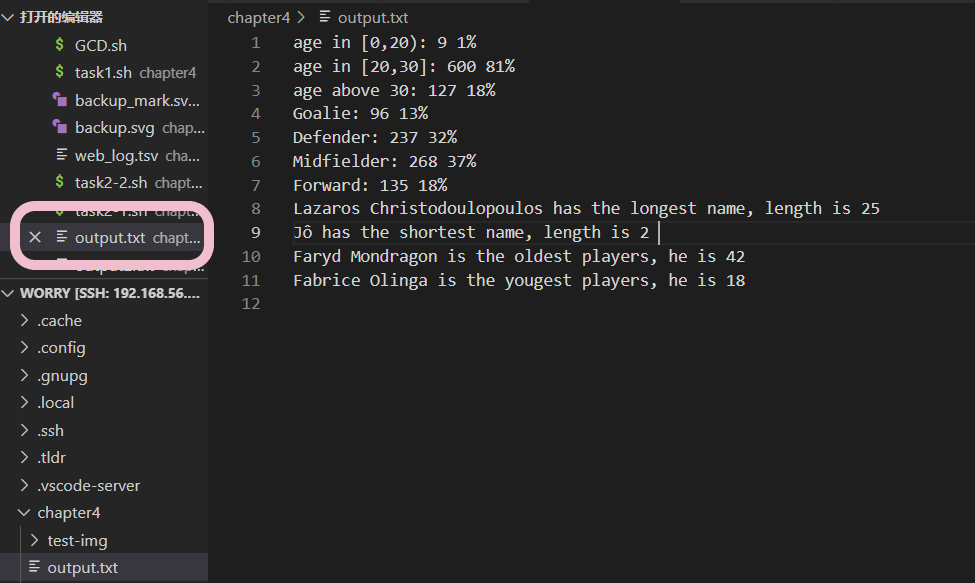

# 实验四：任务二 ——2014世界杯运动员数据统计结果记录

## 实验目的

* 编写脚本处理

## 实验环境

* 本机linux系统：ubutun 20.04.03 live-server 64bit

## 实验要求

* 用bash编写一个文本批处理脚本，对以下附件分别进行批量处理完成相应的数据统计任务：
  * 2014世界杯运动员数据
    - [x] 统计不同年龄区间范围（20岁以下、[20-30]、30岁以上）的球员数量、百分比
    - [x] 统计不同场上位置的球员数量、百分比
    - [x] 名字最长的球员是谁？名字最短的球员是谁？
    - [x] 年龄最大的球员是谁？年龄最小的球员是谁？

## 实验结果汇总

* 统计不同年龄区间范围（20岁以下、[20-30]、30岁以上）的球员数量、百分比
  * age in [0,20): 9 1% 
  * age in [20,30]: 600 81% 
  * age above 30: 127 18% 

|    年龄   |                 球员数量                |               百分比                  |
| :-------: | :------------------------------------: | :-----------------------------------: |
|    **[0,20)**     |            9           |             1%              |
|     **[20,30]**      |                   600                     |                       81%                      |
|     **above 30**      |                    127                     |                  18%                        |

------
* 统计不同场上位置的球员数量、百分比s
  * Goalie: 96 13% 
  * Defender: 237 32% 
  * Midfielder: 268 37% 
  * Forward: 135 18% 

|    年龄   |                 球员数量                |               百分比                  |
| :-------: | :------------------------------------: | :-----------------------------------: |
|    **Goalie**     |            96           |             13%              |
|     **Defender**      |                   237                   |                       32%                      |
|     **Midfielder**      |                    268                     |                  37%                        |
|     **Forward**      |                    135                     |                  18%                        |

------

* 名字最长的球员是谁？名字最短的球员是谁？
  * **Lazaros Christodoulopoulos** has the longest name, length is **25** 
  * **Jô** has the shortest name, length is **2** 

* 年龄最大的球员是谁？年龄最小的球员是谁？
  * **Faryd Mondragon** is the oldest players, he is **42** 
  * **Fabrice Olinga** is the yougest players, he is **18** 

## 实验结果记录过程

* 将输出结果整理
```shell
printf "%s has the longest name, length is %s \n" "${longest}" "${max}" >>./output.txt
```



```
age in [0,20): 9 1% 
age in [20,30]: 600 81% 
age above 30: 127 18% 
Goalie: 96 13% 
Defender: 237 32% 
Midfielder: 268 37% 
Forward: 135 18% 
Lazaros Christodoulopoulos has the longest name, length is 25 
Jô has the shortest name, length is 2 
Faryd Mondragon is the oldest players, he is 42 
Fabrice Olinga is the yougest players, he is 18 
```